# Laporan Modul 2: Laravel Fundamentasl
**Mata Kuliah:** Workshop Web Lanjut   
**Nama:** [Liza Aulia Siregar]  
**NIM:** [2024573010002]  
**Kelas:** [TI.2C]  

---

## Abstrak 
Laporan ini merupakan hasil praktikum yang memperkenalkan kita pada fondasi utama dalam membangun Larevel. Untuk memahami routing, middleware, penanganan request/response, controller, view, dan Blade templating yang sangat penting untuk mengembangkan dengan Laravel secara efektif.
---

## 1. Dasar Teori
MVC (Model–View–Controller) adalah sebuah pola arsitektur perangkat lunak yang digunakan untuk memisahkan concern dalam aplikasi web, yaitu :
- Model : Yang merepresentasikan data dan logika bisnis. Biasanya dalam Laravel ditangani oleh Eloquent models yang berinteraksi dengan database.
- View : Yang menangani lapisan presentasi yaitu HTML yang ditampilkan kepada pengguna. Laravel menggunakan Blade sebagai template engine untuk view.
- Controller : Yang Mengatur alur antara model dan view. Controller menerima input dari pengguna (melalui route), memprosesnya (seringkali melibatkan model), dan mengembalikan view atau respons yang sesuai.
- Routing di Laravel mendefinisikan bagaimana aplikasi merespons permintaan (request) yang masuk. Routing memetakan URI ke aksi controller atau closure.
- Middleware menyediakan mekanisme untuk memfilter permintaan HTTP yang masuk ke aplikasi. Middleware bertindak sebagai lapisan yang berada di antara siklus request dan response.
-  Cara Laravel menangani Request dan Response :
**Mengakses Data Request**
Dalam mengakses data request, dapat mengakses data request menggunakan objek Request

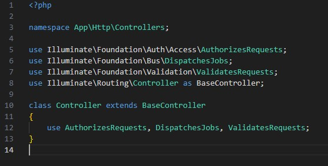

Pengguna juga dapat dengan mudah mengakses parameter query, data form, dan payload JSON.
Dalam controller atau route closure

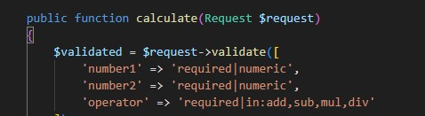

**Form Request**
Dalam Laravel memungkinkan kita untuk memvalidasi dan mengotorisasi data request yang masuk melalui class form request dengan menjalanakan perintah :
php artisan make:request StoreUserRequest

**Mengembalikan Response**
Laravel juga menyediakan cara sederhana untuk mengembalikan response dengan mengembalikan string, view, JSON atau bahkan file download.

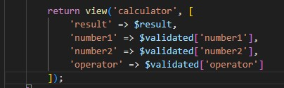

**Peran Controller dan View**
Controller digunakan untuk mengatur logika aplikasi Anda. File controller berada di dalam app/Http/Controllers. Di dalam controller bisa mendefenisikan sebuah method untuk menangani route tertentu.

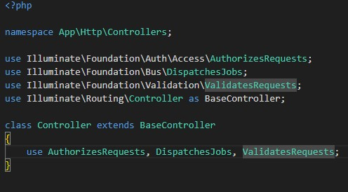

Di file routes/web.php, kita dapat mendaftarkan route agar terhubung ke method controller tersebut:

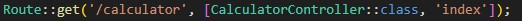

View disimpan di dalam resources/views.

**Fungsi Blade Templating Engine.**
Blade merupakan template angine yang disediakan oleh laravel. Ini dapat membawa kemudahan, kejelasan, dan kecepatan ke dunia pengembangan web.

## 2. Langkah-Langkah Praktikum
2.1 Praktikum 1 – Route, Controller, dan Blade View
1. Buka project masing-masing menggunakan vscode
2. Buka file routes/web.php dan edit kode nya menjadi seperti berikut:

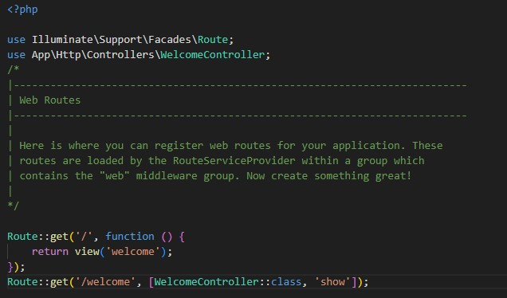

Route ini untuk memanggil method show() yang ada di dalam WelcomeController ketika user mengunjungi /welcome.
3. Buka git bash dan jalankan perintah berikut untuk membuat controller 

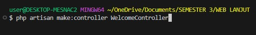

4. Buka file controller yang telah dibuat tadi
Edit menjadi

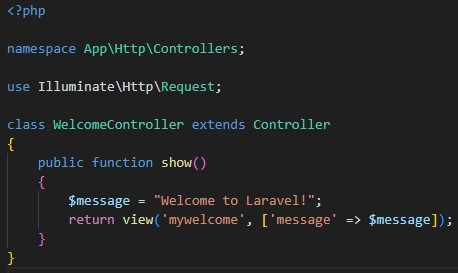

5. Buat file baru resources/views/mywelcome.blade.php dan isi dengan kode berikut :

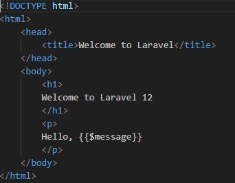

6. Jalankan project laravel dengan perintah 

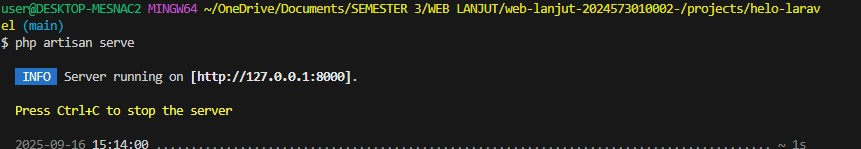

7. Jalankan aplikasi dengan mengetikkan http:localhost:8000/welcome di browser

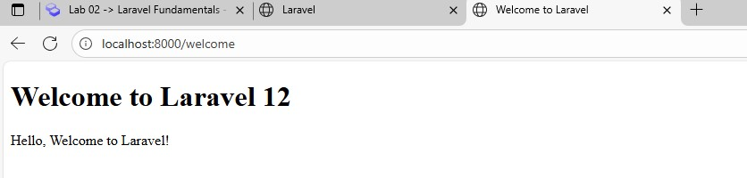

2.2 Praktikum 2 – Membuat Aplikasi Sederhana "Calculator"

1. Tambahkan route untuk kalkulator.

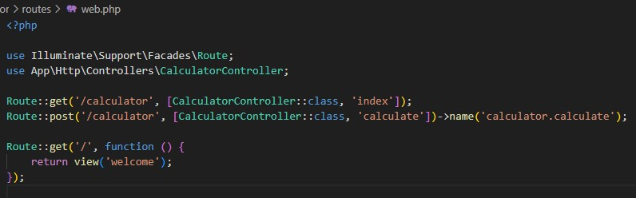

2. Buat controller CalculatorController dengan perintah 

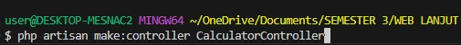

dan isi dengan kode berikut :

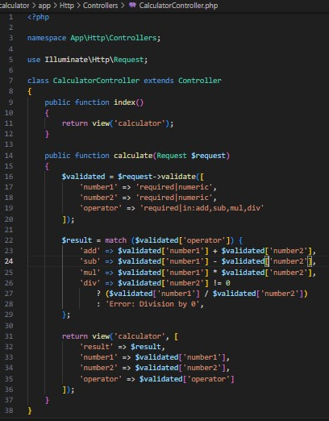

3. Tambahkan di resources/views/calculator.blade.php

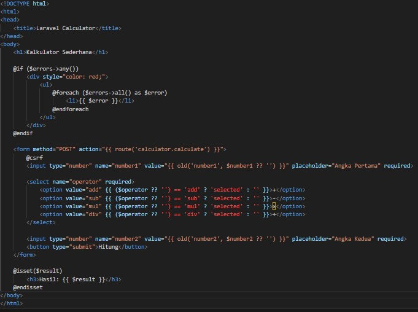

4. Jalankan aplikasi dan coba dengan beberapa input berbeda.
**Penjumlahan**

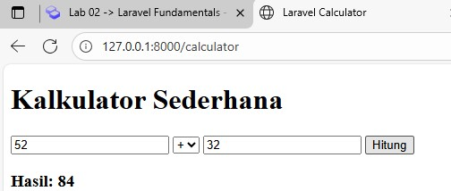

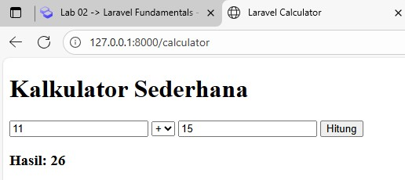

**Pengurangan**

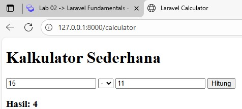

**Perkalian**

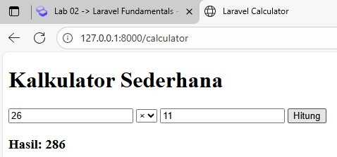

**Pembagian**

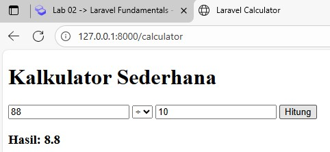

---

## 3. Hasil dan Pembahasan
Jelaskan apa hasil dari praktikum yang dilakukan.
- Apakah aplikasi berjalan sesuai harapan?
Aplikasi yang telah dilakukan pada praktikum ini berjalan sesuai harapan.
- Apa yang terjadi jika ada input yang salah (misalnya pembagian dengan 0)?
Hasilnya akan eror,seperti yang terlihat pada gambar ini

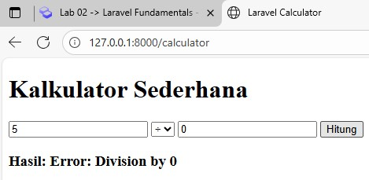

- Bagaimana validasi input bekerja di Laravel?
Validasi yang ada di CalculatorController.php, memastikan yang diinputkan sesuai aturan sebelum perhitungan. Jika inputan dari user tidak sesuai aturan, user akan langsung dibalikkan ke form dengan pesan error

- Apa peran masing-masing komponen (Route, Controller, View) dalam program yang dibuat?
**Route** berperan sebagai penghubung URL yang akan diakses user yang akan dijalankan di dalam aplikasi
**Controller** berperan sebagai mengelolah logika program, seperti menerima input, melakukan validasi, dan menyiapkan hasil
**View** untuk menampilkan hasil dari inputan user.
---

## 4. Kesimpulan
Dalam praktikum ini memperkenalkan kita pada pondasi utama dalam membangun aplikasi Laravel. Untuk lebih memahami routing, penanganan request/response, controller, view, dan Blade tempating yang sangat penting untuk mulai mengembangakan dengan Laravel secara efektif.

---

## 5. Referensi
- Modul 2 Laravel Fundamental - https://hackmd.io/@mohdrzu/B1zwKEK5xe
- Blade Templating Engine : Mengoptimalkan Pengembangan Web dengan Efisien - https://baraka.uma.ac.id/blade-templating-engine-mengoptimalkan-pengembangan-web-dengan-efisien/#:~:text=Blade%20Templating%20Engine%20membawa%20kemudahan,web%20yang%20kompleks%20dengan%20mudah

---
